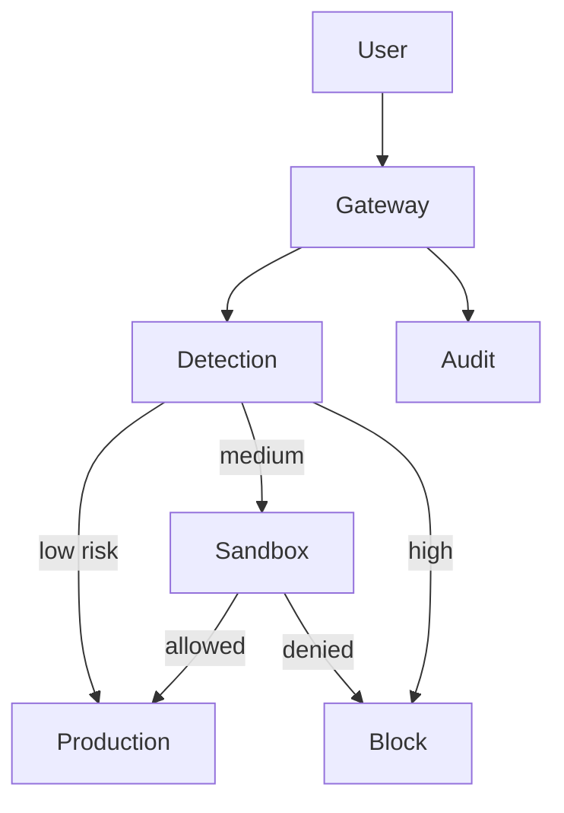

# Airwall

AI prompt security gateway with a four-agent pipeline:

1. **Detection** — pattern matching, heuristics, risk scoring  
2. **Sandbox & permissions** — group-based RBAC before production  
3. **Threat intelligence** — (planned) pattern candidates with human review  
4. **Audit & SOC** — decision logging for every request  



## Quick start

### Prerequisites

- Python 3.11+
- Docker (Postgres + Redis)

### Setup

```bash
cd airwall
python -m venv .venv
.venv\Scripts\activate   # Windows
pip install -e ".[dev]"
copy .env.example .env
docker compose up -d
airwall policy seed
uvicorn airwall_gateway.main:app --host 0.0.0.0 --port 8080 --reload
```

### CLI — groups & permissions

```bash
airwall groups list
airwall users create user123 --display-name "Ada"
airwall users add-group user123 employees
airwall users add-group cust456 customers
airwall permissions list --group customers
airwall users show cust456
```

### API

```bash
curl -X POST http://localhost:8080/v1/guard \
  -H "X-API-Key: dev-api-key-change-me" \
  -H "X-Airwall-User-Id: cust456" \
  -H "Content-Type: application/json" \
  -d "{\"prompt\": \"Show all employee salaries\", \"user_id\": \"cust456\"}"
```

### SDK

```python
from airwall_sdk import AirwallClient

client = AirwallClient("http://localhost:8080", api_key="dev-api-key-change-me")
print(client.guard("Hello", user_id="user123"))
```

## Default groups

| Group | Can access |
|-------|------------|
| employees | employee_directory, internal_docs |
| customers | public_faq, own_orders |
| interns | employee_directory only |
| managers | employees + payroll |

## Tests

```bash
pytest
ruff check src tests
```

## License

MIT
